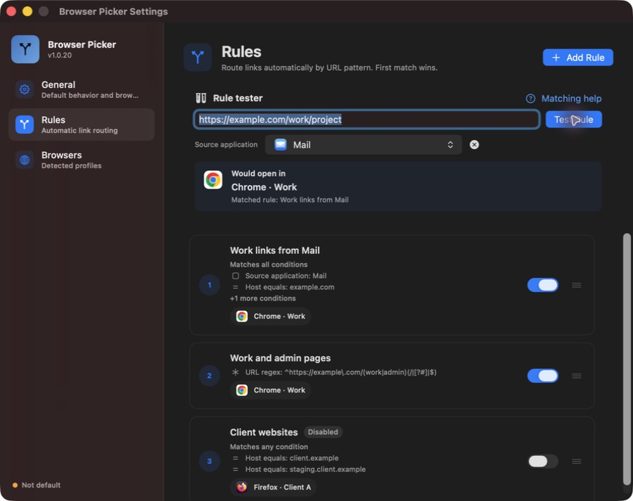
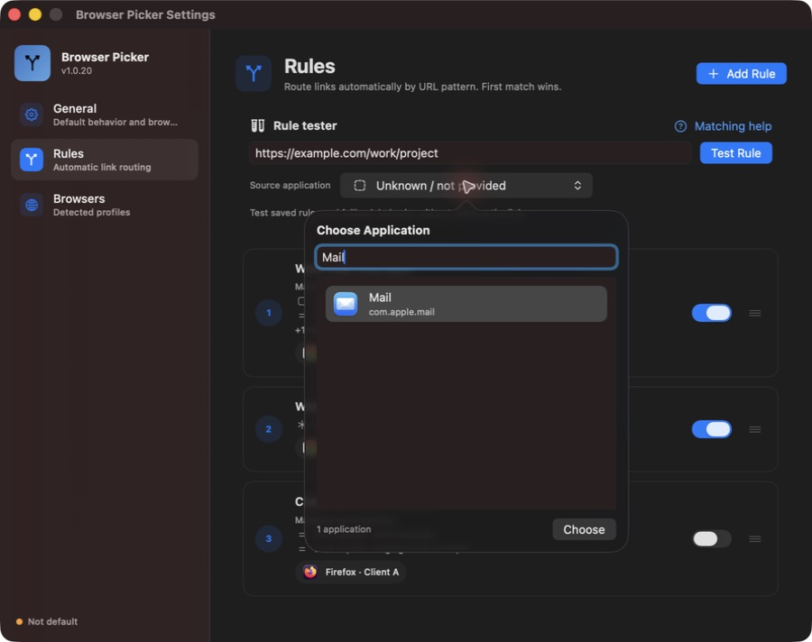
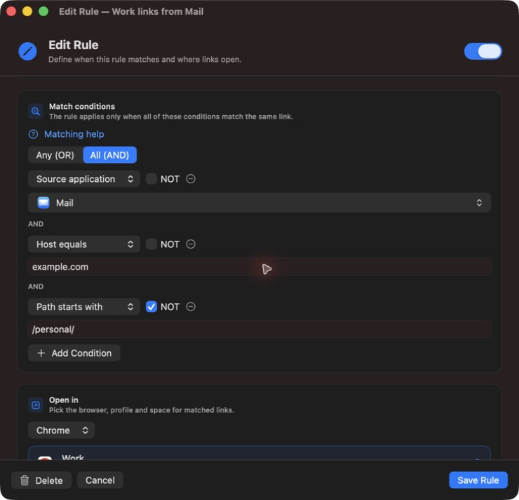
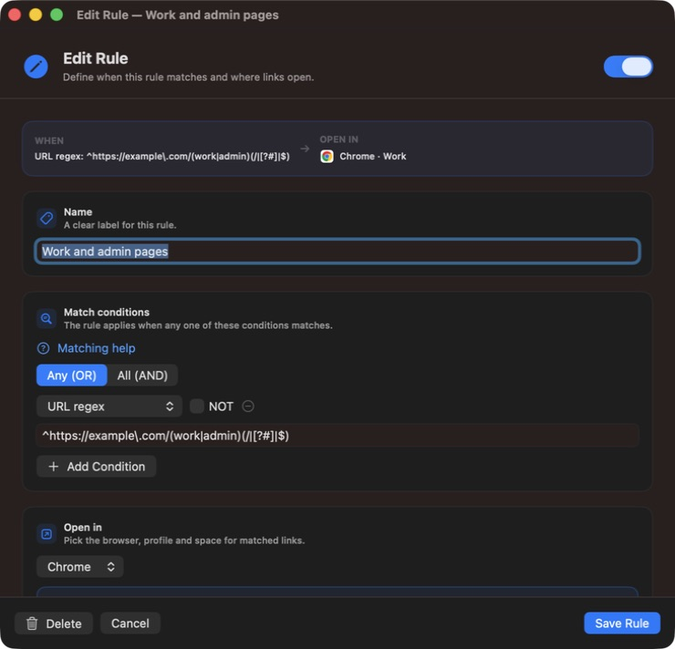
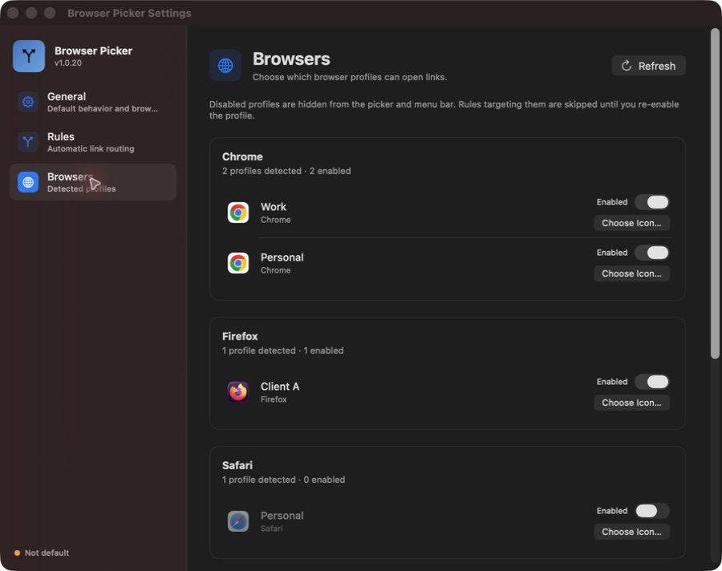
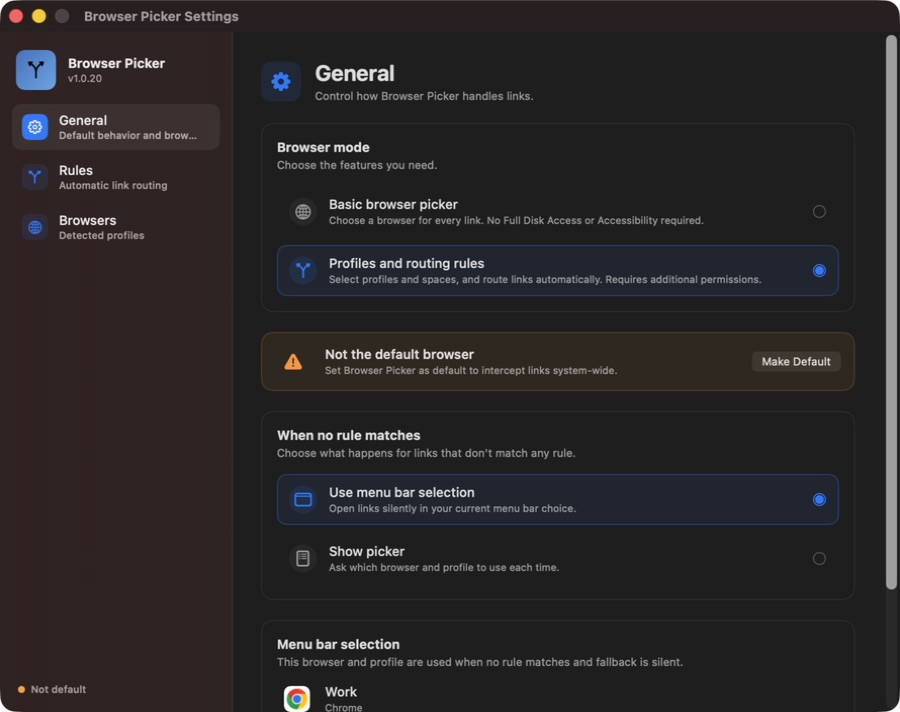

<p align="center">

</p>

<h1 align="center">Browser Picker</h1>

<p align="center">
A native macOS menu bar app that becomes your <b>default browser</b> and sends every link to the right <b>browser <em>and</em> profile</b> — automatically with rules, or with a quick picker.
</p>

<p align="center">


<a href="https://github.com/mertizci/browser-picker/releases/latest"></a>
<a href="https://www.paypal.com/donate/?hosted_button_id=8BKTHWAHUPWPG"></a>
</p>

<p align="center">
<a href="https://mertizci.github.io/browser-picker/"><b>Website</b></a> ·
<a href="https://github.com/mertizci/browser-picker/releases/latest"><b>Download</b></a> ·
<a href="#screenshots"><b>Screenshots</b></a>
</p>

---

## Why Browser Picker?

Keep work links in your work profile, personal links in your personal browser, and client sites in their own account. Browser Picker can route links automatically using the URL and the application they came from, or simply ask which browser to use each time.

Supports **Chrome, Edge, Brave, Vivaldi, Dia, Firefox, Zen, and Safari**, including profiles and Zen spaces where available.

This README describes the current source. Features shown here may not yet be available in the latest published release. Screenshots use example rules and profiles.

## Features

- **Browser, profile, and Zen space routing** — choose the destination for each rule or from the picker.
- **Source application matching** — search installed apps by name, then route links from Mail, Slack, or another application.
- **Multiple conditions per rule** — combine conditions with **Any (OR)** or **All (AND)**, and apply **NOT** to individual conditions.
- **Eight condition types** — URL contains, host equals, host suffix, path equals, path starts with, path contains, URL regex, and source application.
- **Rule tester** — preview the matching saved rule and destination without opening the URL.
- **Quick rule management** — duplicate from the context menu, toggle rules directly in the list, and drag to change priority.
- **Rule conflict warnings** — see identical conditions and rules fully covered by an earlier rule, including conflicting destinations, in the list and while editing.
- **Profile controls** — hide unused profiles and give each profile its own image or company logo.
- **Basic browser picker** — use the app without Full Disk Access or Accessibility, with one entry per browser.
- **Offline matching guide** — open **Matching help** from the rule editor or tester for examples and explanations.
- **Native windows** — move and resize the rule editor; its last size is remembered for both new and existing rules, including after restarting. The Dock icon appears while app windows are open and disappears when the last one closes.

## Install and get started

Release DMGs are universal builds for **Apple Silicon and Intel**, signed with a Developer ID certificate and notarized by Apple. Requires **macOS 14.0 or later**.

1. Download `BrowserPicker-X.Y.Z.dmg` from the **[latest release](https://github.com/mertizci/browser-picker/releases/latest)**.
2. Open the DMG and drag **Browser Picker** into **Applications**.
3. Launch it and choose **Continue Without Permissions** for Basic mode, or complete permission setup for profiles and routing rules.
4. Choose **Set as Default Browser…** from the menu bar so Browser Picker receives links.
5. In profile mode, open **Settings → Browsers** to enable the profiles you use, then **Settings → Rules** to set up routing.

Alternatively, install with Homebrew:

```bash
brew install --cask mertizci/tap/browser-picker
```

## Screenshots

### Rules and live routing preview



Test a URL and source application, see the destination, and manage rule priority and enabled state in the same page.

### Search for a source application



The application picker filters as you type and supports arrow keys and Return. The same selector is available in rule conditions and the tester.

### Combine conditions with AND, OR, and NOT



This rule requires a link from Mail to `example.com`, except paths starting with `/personal/`. The form scrolls while Save and Cancel stay visible.

### Match URL patterns with regex



Use regex for patterns that need alternatives or precise boundaries. **Matching help** opens the offline guide alongside the editor.

### Choose the profiles you use



Disable unused profiles and customize their icons in **Settings → Browsers**.

### Choose Basic mode or profile features



Switch modes in **Settings → General → Browser mode**. Your profile settings and rules remain saved when using Basic mode.

## Create and manage rules

Open **Settings → Rules → Add Rule**, give the rule a name, add its conditions, and select a destination browser and profile. For Zen, you can also select a space. Click **Save Rule** when ready.

Rules run in list order. The first enabled rule whose conditions match and whose destination profile is available and enabled handles the link. Drag rules to change their priority. If none match, your fallback applies:

| Fallback | What happens |
| --- | --- |
| **Use menu bar selection** | Opens silently in the current browser and profile selection. |
| **Show picker** | Asks which browser and profile to use. |

Right-click a rule and choose **Duplicate** to insert an independent copy below it. The copy preserves the conditions, match mode, destination, and enabled state. Use the switch in each rule row to disable or re-enable it without editing or deleting it.

The editor opens in a movable, resizable window. Add Rule and Edit Rule share the last saved window size; it is fitted to the current screen when needed. Scroll to reach additional fields while the action buttons remain visible.

### Conflicting rules

Warnings appear in the rule list and editor when an earlier enabled rule has the same conditions or fully covers a later rule. They name the earlier rule and distinguish duplicate conditions with the same destination from identical conditions pointing to a different browser, profile, or space. The editor also shows the earlier destination and updates as you change the draft or reorder saved rules.

For example, **Host equals `example.com` → Chrome · Work** above **Host equals `example.com` AND Path starts with `/personal/` → Chrome · Personal** prevents the personal rule from being reached. Move the more specific rule above the general one, narrow the earlier rule, or disable one of them. Warnings are advisory; saving is still allowed.

Checks ignore disabled rules, disabled destination profiles, and Basic mode. They detect identical conditions regardless of order and common full-coverage relationships for URL text, hosts, paths, AND/OR, and NOT. They do not attempt to prove partial overlaps, coverage by several earlier rules together, or equivalence between different regex patterns. Identical regex text is reported as duplicate conditions; regexes are not executed by the conflict checker. No warning is not a guarantee that two rules cannot overlap—use Rule tester for specific links. A missing profile still participates because live routing selects that rule before reporting the unavailable destination.

### AND, OR, and NOT

| Control | Meaning | Example |
| --- | --- | --- |
| **Any (OR)** | At least one condition must match. | Host equals `example.com` **OR** host equals `client.example`. |
| **All (AND)** | Every condition must match the same link. | Source application **Mail** **AND** host equals `example.com`. |
| **NOT** | Inverts that individual condition. | Host equals `example.com` **AND NOT** path starts with `/personal/`. |

Use **OR** to collect different websites or applications under one rule. Use **AND** to restrict a rule to a particular application, domain, and path. Two different exact hostnames joined with AND cannot both match one URL. One match mode applies to the whole condition list; nested groups are not supported. Existing single-condition rules continue to work, and older multi-condition rules retain OR behavior.

### Available conditions

| Condition | Checks | Example value | Case-sensitive? |
| --- | --- | --- | --- |
| **URL contains** | Text anywhere in the full URL, including query and fragment. | `project=work` | No |
| **Host equals** | The exact hostname, without scheme, port, or path. | `example.com` | No |
| **Host suffix** | A literal hostname ending. See the boundary note below. | `example.com` | No |
| **Path equals** | The entire decoded URL path. | `/work/dashboard` | Yes |
| **Path starts with** | A literal prefix of the decoded path. | `/work/` | Yes |
| **Path contains** | Text anywhere in the decoded path. | `/reports/` | Yes |
| **URL regex** | A regular expression against the full URL. | See examples below. | Yes; use `(?i)` to ignore case |
| **Source application** | The sending application's bundle identifier. | Choose **Mail** (`com.apple.mail`) | No |

Path conditions exclude the query and fragment, decode percent escapes, and treat an empty path as `/`. **Path equals** and **Path starts with** must start with `/`. Prefixes are literal: `/work` also matches `/workshop`; `/work/` matches descendants but not `/work` itself. Use OR with an exact path when you need both.

**Host suffix preserves literal suffix matching:** `example.com` matches `docs.example.com`, but also `notexample.com`. Adding a leading dot does not change this behavior. Use **Host equals** for an exact domain, or the bounded domain regex below for a domain and its subdomains.

### Route by source application

1. Add a **Source application** condition.
2. Click **Choose Application…** and type the app's name. Results show its icon, name, and bundle identifier; you can also search by identifier.
3. Click the application or use the arrow keys and Return to choose it.
4. Select **All (AND)** if the URL must also match a domain or path.

For example, **Mail AND Host equals `example.com` AND NOT Path starts with `/personal/` → Chrome · Work** routes only the matching links received from Mail. Choosing OR instead would also match any link from Mail or any link to that domain.

Browser Picker saves the application's bundle identifier, so the condition does not depend on its installation path. The sender is taken from the macOS link-opening event. A helper application may appear as the sender, and some links provide no identifiable source. An unknown source does **not** match a Source application condition, even with NOT. URL-only rules and fallback still work.

### Regex examples

Select **URL regex** and paste the raw expression without surrounding `/.../` delimiters. Regex searches the full URL, including query and fragment. Use `^` and `$` when you need to anchor a match; escape a literal dot as `\.`. Invalid expressions show an error and cannot be saved. Interrupted or failed regex checks do not match, including under NOT.

**Work or admin pages on one HTTPS domain:**

```regex
^https://example\.com/(work|admin)(/|[?#]|$)
```

Matches `https://example.com/work`, `/work/project`, and `/admin?tab=users`. Does not match `/workshop` or another hostname.

**A domain and its subdomains, with a hostname boundary:**

```regex
(?i)^https?://([a-z0-9-]+\.)*example\.com(:[0-9]+)?(/|[?#]|$)
```

Matches `https://example.com/` and `https://docs.example.com/work`, including uppercase variants. Does not match `https://notexample.com/` or `https://example.com.other.test/`.

For more recipes, click **Matching help** in the editor or Rules page. The guide is bundled with the app and opens offline; its [HTML source](BrowserPicker/Resources/rule-matching-help.html) is also in this repository.

## Test a rule without opening a browser

In **Settings → Rules → Rule tester**:

1. Enter a complete `https://` or `http://` URL.
2. If your rules use source conditions, choose a **Source application**. Leave it unset to simulate an unknown sender.
3. Click **Test Rule** or press Return.

The result shows the first matching **saved** rule and the browser, profile, and Zen space it would use. If no rule matches, it explains whether the menu bar selection or picker will handle the link. Disabled rules and disabled profiles are skipped. Unavailable destinations and an empty list of enabled profiles are reported.

Testing uses the same routing decision as incoming links and does not open the URL. Save editor changes before testing them. Changing the URL, source, settings, or discovered profiles clears the previous result; run the test again.

## Customize and hide profiles

In **Settings → Browsers**, click **Choose Icon…** beside a profile and select an image or company logo. Supported formats include PNG, JPEG, HEIC, TIFF, GIF, and BMP. The custom icon appears in the link picker, menu bar selection, settings, and rules. Browser Picker saves a copy, so moving the original file does not remove it. Use **Change Icon…** to replace it or **Use Browser Icon** to reset it.

Turn off **Enabled** to hide a profile from the picker, menu bar choices, and rule destinations. Rules targeting it are skipped until you re-enable it; their definitions and its custom icon stay saved. If you disable the current selection, another enabled profile becomes the selection. If none remain, links prompt you to enable one. These choices survive refreshes and restarts; newly discovered profiles start enabled.

## Basic mode and permissions

Choose **Continue Without Permissions** during setup, or **Basic browser picker** in **Settings → General → Browser mode**, to use the app without granting Full Disk Access or Accessibility.

| Capability | Basic browser picker | Profiles and routing rules |
| --- | --- | --- |
| Choose a browser for each link | Yes | Yes, with picker fallback |
| Choose profiles or Zen spaces | No; the browser chooses its current/default profile | Yes |
| Automatic routing rules | Paused | Enabled |
| Read browser profile files / automate browser menus | No | Used for profile features |
| Hide entries and customize icons | Per browser | Per profile |

Basic mode is remembered across restarts. It always shows a browser picker for incoming links, pauses rules and silent fallback, and preserves your full-mode settings. Switching back restores profile features and returns to permission setup when needed.

| Permission | Used for |
| --- | --- |
| **Accessibility** | Safari and Dia profile menu automation, and Zen space switching. |
| **Full Disk Access** | Reading Safari profile names from its protected `SafariTabs.db`. |

After granting Accessibility, **quit and reopen** Browser Picker.

### Permissions after an update

Official releases retain the application identifier and Developer ID signing requirement used by v1.0.20. The release build and in-app updater verify this identity so an update cannot silently replace it with a different or build-specific identity. macOS uses the signing requirement to recognize the same app across versions; a normal release update should preserve existing grants.

Debug builds use a separate application identifier and settings folder, including when started directly from Xcode, so development builds do not share the release permission entry. A permission previously granted to an ad-hoc or locally re-signed build may still be tied to that exact binary. In that case, quit Browser Picker, remove the old entry from Accessibility and Full Disk Access, add the installed official app again, and reopen it. This is a one-time repair of the old entry, not a step required for each release. The app cannot migrate or grant macOS privacy permissions itself.

## Browser-specific behavior

| Browser family | Profile discovery |
| --- | --- |
| Chrome, Edge, Brave, Vivaldi, Dia | Each browser's `Local State`. |
| Firefox, Zen | `profiles.ini` and selectable Profile Groups. |
| Safari | `SafariTabs.db`, with a menu scan fallback. |
| Zen spaces | The profile's `zen-sessions.jsonlz4` session file. |

Dia ignores command-line profile arguments, so profile routing reuses a matching window or moves the link into the chosen profile through automation.

Zen spaces are grouped under the container that Zen calls their **Profile**. A space-bound route switches a running Zen window through its Spaces menu before handing over the link. Spaces are selected by name; rename duplicate names to distinguish them. Containers without a space are omitted. With multiple Firefox or Zen profile instances running, links may follow the instance that answers the request.

## Windows and configuration

Browser Picker appears in the Dock while an app window is open, including a minimized window. Closing or dismissing the last window removes the Dock icon while the menu bar app keeps running. Opening only the menu bar popover does not add a Dock icon.

Settings, rules, disabled profiles, and custom icons are saved locally in:

```text
~/Library/Application Support/BrowserPicker/config.json
```

The shared Add/Edit Rule window size is stored separately in macOS preferences.

## Build and test

Building requires Xcode with **Swift 5.10 or later** and XcodeGen. A stable Apple Development signing identity is recommended to preserve Accessibility authorization across rebuilds.

```bash
brew install xcodegen
xcodegen generate
xcodebuild -scheme BrowserPicker -destination 'platform=macOS' -configuration Debug build
```

Or open `BrowserPicker.xcodeproj` in Xcode and press ⌘R. Project and signing settings are defined in `project.yml`.

The Debug configuration produces **BrowserPicker Debug.app** with the isolated `com.browserpicker.debug` identifier, separate settings, and release updates disabled. Use `scripts/release.sh <version>` for distribution builds; its permission identity check must pass before notarization and packaging.

Run the checks after generating the project:

```bash
scripts/test-profile-availability.sh
```

The runner covers profile availability, rule editing, advanced conditions, source application matching, routing previews, Basic mode, and window behavior. It uses the Debug dylib and temporary configuration without launching browsers or changing your saved settings.

To verify release identity compatibility against downloaded or built official releases:

```bash
scripts/test-release-identity.sh /path/to/old/BrowserPicker.app /path/to/new/BrowserPicker.app
```

This also checks that ad-hoc signatures, altered bundles, and the debug identity are rejected using disposable copies. Set `RELEASE_TEST_SIGN_IDENTITY` to a local Developer ID identity to also test a valid signature with an incompatible designated requirement. These checks do not install or launch the apps or change permissions.

### Isolated debug app

```bash
scripts/build-debug.sh
```

This creates `build/debug-preview/Products/BrowserPicker Debug.app` and `build/debug-preview/BrowserPicker-Debug.zip` for your Mac's architecture. The debug app has a ladybug menu bar icon, a separate `com.browserpicker.debug` bundle identifier, and its own settings at `~/Library/Application Support/BrowserPicker Debug/config.json`. Release updates are disabled.

The script uses a local Apple Development identity when available. Set `DEBUG_SIGNING_IDENTITY` to override it or `DEBUG_BUILD_DIR` to choose a different output directory. This local debug build is separate from the signed and notarized release DMG.

To check real link handling after making Browser Picker your default browser:

```bash
open "https://example.com"
```

## Project structure

```text
BrowserPicker/
├── BrowserPickerApp.swift     # App entry and incoming URL/source handling
├── Core/                      # Models, settings, matchers, tester, app catalog, routing
├── Browsers/                  # Browser launchers, profile discovery, permissions
├── UI/                        # Picker, settings, rule editor, application selector, help
└── Resources/                 # Offline matching guide, FAQ, browser icons
Tests/                         # Routing, profile, mode, and window checks
scripts/                       # Build, debug packaging, and test helpers
```

## Troubleshooting

- **A rule does not match** — save it, check its enabled switch and target profile, then use Rule tester with the actual URL and source application. Check priority, AND/OR, NOT, and path case sensitivity.
- **Source application does not match** — the sender may be a helper or unavailable. Test both a selected app and an unknown source; use a URL-only rule if the sender cannot be identified.
- **Rules are paused** — switch from Basic mode to **Profiles and routing rules** in General settings.
- **Accessibility still shows not granted** — quit and reopen the app, or use **Quit & Reopen**.
- **Safari profiles are missing** — grant Full Disk Access, or open Safari and use **Scan Safari Profiles** in Settings → Browsers with Accessibility enabled.
- **Zen spaces are missing** — open the profile in Zen so it writes its session file, then refresh profiles.
- **The editor does not show every field** — resize the window or scroll the form. Save and Cancel stay at the bottom, and the next editor opens at your saved size.
- **App icon looks blank** — quit and reopen; if it persists, log out and back in to refresh the macOS icon cache.

## Contact

Developed by **Mert IZCI** — [mertizci@gmail.com](mailto:mertizci@gmail.com).

## License

Browser Picker is licensed under the [MIT License](LICENSE.md). Browser SVG fallbacks use [Simple Icons](https://simpleicons.org/) (MIT). See [icon attribution](BrowserPicker/Resources/Icons/browsers/ATTRIBUTION.md).
